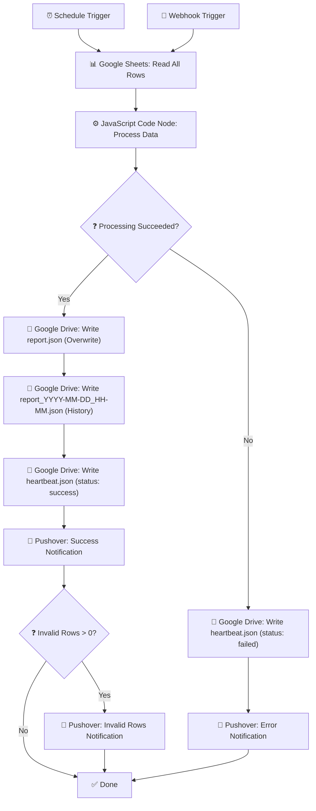

# n8n Workflow Guide — The Analyst Data Pipeline

> **Purpose**: Step-by-step guide to build the complete n8n automation workflow that processes Google Sheet data and generates the JSON file consumed by The Analyst Dashboard.

---

## Table of Contents

1. [Workflow Overview](#1-workflow-overview)
2. [Prerequisites](#2-prerequisites)
3. [Node-by-Node Setup](#3-node-by-node-setup)
4. [Google Drive Setup](#4-google-drive-setup)
5. [Onboarding a New Client](#5-onboarding-a-new-client)
6. [Testing & Troubleshooting](#6-testing--troubleshooting)

---

## 1. Workflow Overview

### What This Workflow Does

1. **Triggers** on a configurable schedule OR via a webhook (manual refresh from the dashboard)
2. **Fetches** the entire Google Sheet (all rows, every run — full refresh)
3. **Processes** the data with a JavaScript code node (validates, cleans, builds JSON)
4. **Writes** the final JSON to Google Drive (overwrites the main file)
5. **Writes** a timestamped historical snapshot to a `/history` folder on Google Drive
6. **Writes** a `heartbeat.json` to Google Drive for monitoring
7. **Sends** a Pushover notification on success
8. **Handles errors**: writes a failed heartbeat + sends error notification
9. **Reports** invalid rows via a separate notification if any are found

### Workflow Diagram



### Node Summary

| # | Node Name | Node Type | Purpose |
|---|-----------|-----------|---------|
| 1 | Schedule Trigger | Schedule Trigger | Runs workflow on configured interval |
| 2 | Webhook Trigger | Webhook | Allows manual refresh from dashboard |
| 3 | Read Orders | Google Sheets | Fetches all rows from the orders sheet |
| 4 | Process Data | Code (JavaScript) | Validates, cleans, and builds JSON output |
| 5 | Write Main JSON | Google Drive | Overwrites `report.json` on Google Drive |
| 6 | Write History Snapshot | Google Drive | Creates timestamped copy in `/history` |
| 7 | Write Heartbeat | Google Drive | Writes `heartbeat.json` with success status |
| 8 | Notify Success | Pushover | Sends success notification to client |
| 9 | Check Invalid Rows | IF | Checks if there are invalid rows to report |
| 10 | Notify Invalid Rows | Pushover | Sends invalid rows details to client |
| 11 | Error Handler | Error Trigger | Catches any node failure |
| 12 | Write Failed Heartbeat | Google Drive | Writes `heartbeat.json` with failed status |
| 13 | Notify Error | Pushover | Sends error notification to developer |

---

## 2. Prerequisites

### 2.1 n8n Instance

- Self-hosted n8n on the client's VPS (or a shared n8n instance)
- Minimum version: n8n **1.20+**
- No additional runtime dependencies required — JavaScript runs natively in n8n

### 2.2 Google Cloud Credentials

You need a **Google Cloud Service Account** with access to Google Sheets and Google Drive APIs.

**Setup Steps:**

1. Go to [Google Cloud Console](https://console.cloud.google.com/)
2. Create a new project (or use existing): e.g., `the-analyst-pipeline`
3. Enable these APIs:
   - Google Sheets API
   - Google Drive API
4. Create a Service Account:
   - Go to **IAM & Admin → Service Accounts**
   - Click **Create Service Account**
   - Name: `analyst-pipeline`
   - Click **Create and Continue**
   - Skip roles for now → Click **Done**
5. Create a key:
   - Click on the service account → **Keys** tab → **Add Key → Create new key → JSON**
   - Download the JSON key file — you'll need this in n8n
6. Share the client's Google Sheet with the service account email (e.g., `analyst-pipeline@project.iam.gserviceaccount.com`) — give **Viewer** access
7. Share the Google Drive output folder with the service account — give **Editor** access

**In n8n:**
- Go to **Credentials → Add Credential → Google Sheets API** (or Google API)
- Choose **Service Account** authentication
- Paste the JSON key file contents

### 2.3 Pushover Credentials

1. Create a [Pushover](https://pushover.net/) account
2. Create an application (e.g., "The Analyst")
3. Note your **User Key** and **Application API Token**
4. In n8n: **Credentials → Add Credential → Pushover API** → enter User Key and API Token

---

## 3. Node-by-Node Setup

### Node 1: Schedule Trigger

| Property | Value |
|----------|-------|
| **Node Type** | Schedule Trigger |
| **Node Name** | `Schedule Trigger` |
| **Rule** | Configure based on client agreement |

**Configuration:**

- **Trigger interval**: Set based on what was agreed during onboarding
  - Daily at 6:00 AM: `Cron Expression` → `0 6 * * *`
  - Every 3 days at 6:00 AM: `Cron Expression` → `0 6 */3 * *`
  - Weekly on Monday at 6:00 AM: `Cron Expression` → `0 6 * * 1`
- **Timezone**: Set to client's timezone (e.g., `Africa/Casablanca` for Morocco)

**Connection:** Output → Node 3 (Read Orders)

---

### Node 2: Webhook Trigger

| Property | Value |
|----------|-------|
| **Node Type** | Webhook |
| **Node Name** | `Webhook Trigger` |
| **HTTP Method** | POST |
| **Path** | `refresh-report` |
| **Response Mode** | Immediately |
| **Response Code** | 200 |

**Configuration:**

- **Path**: `refresh-report` — this generates a webhook URL like `https://your-n8n-domain.com/webhook/refresh-report`
- **Response Mode**: "Respond Immediately" — the webhook responds with 200 right away, then continues processing in the background. This is important because the dashboard doesn't wait for the processing to finish.
- **Response Data**: `{ "status": "processing", "message": "Report refresh started" }`

**Connection:** Output → Node 3 (Read Orders)

> **IMPORTANT**: Both the Schedule Trigger and Webhook Trigger connect to the SAME next node (Read Orders). In n8n, this means you draw a connection from each trigger to the Read Orders node.

---

### Node 3: Read Orders (Google Sheets)

| Property | Value |
|----------|-------|
| **Node Type** | Google Sheets |
| **Node Name** | `Read Orders` |
| **Operation** | Read Rows |
| **Credential** | Your Google Sheets API credential |

**Configuration:**

- **Document**: Select the client's Google Sheet by URL or ID
  - For Le Peignoir: the specific spreadsheet URL/ID containing their orders
- **Sheet**: Select the sheet/tab containing orders (e.g., "Orders" or "Commandes")
- **Options**:
  - **Range**: Leave empty (fetches all rows)
  - **First row contains headers**: Yes (checked)
  - **Return All Items**: Yes (not paginated)

This node outputs one n8n item per row in the sheet. Each item has the column headers as field names.

**Connection:** Output → Node 4 (Process Data)

---

### Node 4: Process Data (JavaScript Code Node)

| Property | Value |
|----------|-------|
| **Node Type** | Code |
| **Node Name** | `Process Data` |
| **Language** | JavaScript |
| **Mode** | Run Once for All Items |

This is the core of the workflow. The JavaScript code below has two clearly separated sections:

1. **Client Config** (top section) — the ONLY part that changes per client
2. **Universal Processing Logic** (everything after) — NEVER changes between clients

**Complete JavaScript Code:**

```javascript
// =============================================================================
// CLIENT CONFIG — ONLY EDIT THIS SECTION PER CLIENT
// =============================================================================

const CONFIG = {
  business_name: "Le Peignoir",
  currency: "MAD",

  // Column mappings: map your Google Sheet column headers to internal names
  date_column: "Date",
  revenue_column: "Prix Final",
  original_price_column: "Prix Original",
  status_column: "Statut Livraison",
  reference_column: "Référence",
  promo_code_column: "Code Promo",
  discount_column: "Remise",
  client_name_column: "Nom Complet",
  client_phone_column: "Téléphone",

  // Dimensions: each dimension has a key (internal), column (sheet header),
  // label (display name), and chart_type (bar or pie)
  dimensions: [
    { key: "pack",    column: "Pack",    label: "Pack",    chart_type: "bar" },
    { key: "ville",   column: "Ville",   label: "Ville",   chart_type: "bar" },
    { key: "couleur", column: "Couleur", label: "Couleur", chart_type: "pie" },
    { key: "motif",   column: "Motif",   label: "Motif",   chart_type: "pie" },
    { key: "tissu",   column: "Tissu",   label: "Tissu",   chart_type: "pie" },
    { key: "taille",  column: "Taille",  label: "Taille",  chart_type: "bar" },
    { key: "genre",   column: "Genre",   label: "Genre",   chart_type: "pie" },
  ],

  // Status mappings: map semantic status names to actual values in the sheet
  // Each status category is an array of possible values (case-insensitive matching)
  statuses: {
    delivered:   ["Livré"],
    cancelled:   ["Annulé"],
    no_response: ["Pas de réponse"],
    pending:     ["En attente", "En cours de livraison"],
  },

  // Schedule interval in hours (used by dashboard to detect stale data)
  // 168 = weekly, 24 = daily, 72 = every 3 days
  schedule_interval_hours: 168,
};

// =============================================================================
// UNIVERSAL PROCESSING LOGIC — DO NOT EDIT BELOW THIS LINE
// =============================================================================

function getField(row, columnName, defaultVal = "") {
  const value = row[columnName];
  if (value === undefined || value === null) return defaultVal;
  return String(value).trim();
}

function parseNumber(value, defaultVal = 0) {
  if (value === undefined || value === null || String(value).trim() === "") return defaultVal;
  let cleaned = String(value).trim().replace(/\s/g, "").replace(",", ".");
  for (const sym of ["MAD", "DH", "€", "$", "£"]) {
    cleaned = cleaned.split(sym).join("");
  }
  cleaned = cleaned.trim();
  const num = parseFloat(cleaned);
  if (isNaN(num)) return null;
  return num;
}

function parseDate(value) {
  if (value === undefined || value === null || String(value).trim() === "") return null;
  const dateStr = String(value).trim();

  // ISO format: YYYY-MM-DD or YYYY-MM-DDTHH:MM:SS
  let m = dateStr.match(/^(\d{4})-(\d{2})-(\d{2})/);
  if (m) return `${m[1]}-${m[2]}-${m[3]}`;

  // DD/MM/YYYY or DD-MM-YYYY
  m = dateStr.match(/^(\d{1,2})[\/\-](\d{1,2})[\/\-](\d{4})$/);
  if (m) {
    const d = `${m[3]}-${m[2].padStart(2, "0")}-${m[1].padStart(2, "0")}`;
    if (!isNaN(new Date(d).getTime())) return d;
  }

  // YYYY/MM/DD
  m = dateStr.match(/^(\d{4})\/(\d{2})\/(\d{2})$/);
  if (m) return `${m[1]}-${m[2]}-${m[3]}`;

  // Fallback: native Date parsing
  const d = new Date(dateStr);
  if (!isNaN(d.getTime())) return d.toISOString().substring(0, 10);

  return null;
}

function isRowEmpty(row, config) {
  const keyFields = [
    config.date_column,
    config.revenue_column,
    config.status_column,
    config.reference_column,
    config.client_name_column,
  ];
  return keyFields.every(field => getField(row, field) === "");
}

function validateRow(row, rowIndex, config) {
  const errors = [];

  // 1. Validate date
  const rawDate = getField(row, config.date_column);
  const parsedDate = parseDate(rawDate);
  if (parsedDate === null) errors.push("Missing or unparseable date");

  // 2. Validate status
  const rawStatus = getField(row, config.status_column);
  if (rawStatus === "") errors.push("Empty status");

  // 3. Validate revenue (prix_final)
  const rawRevenue = getField(row, config.revenue_column);
  const parsedRevenue = parseNumber(rawRevenue);
  if (parsedRevenue === null) {
    errors.push("Malformed price");
  } else if (parsedRevenue === 0 && rawRevenue !== "" && rawRevenue !== "0") {
    // The field had a value but parsed to 0 unexpectedly
    errors.push("Malformed price");
  }

  if (errors.length > 0) {
    return {
      valid: false,
      error: {
        row: rowIndex + 2,  // +2 because: 0-indexed + 1 header row
        reason: errors.join("; "),
        reference: getField(row, config.reference_column, "N/A"),
      },
    };
  }

  // Build clean order object
  const order = {
    date: parsedDate,
    reference: getField(row, config.reference_column),
    prix_final: parsedRevenue !== null ? parsedRevenue : 0,
    status: rawStatus,
    promo_code: getField(row, config.promo_code_column),
    discount: parseNumber(getField(row, config.discount_column), 0),
    original_price: parseNumber(getField(row, config.original_price_column), parsedRevenue || 0),
    client_name: getField(row, config.client_name_column),
    client_phone: getField(row, config.client_phone_column),
  };

  // Add dimension fields
  for (const dim of config.dimensions) {
    order[dim.key] = getField(row, dim.column);
  }

  return { valid: true, order };
}

function processAllRows(items, config) {
  const validOrders = [];
  const invalidRows = [];

  items.forEach((item, i) => {
    const row = item.json;

    // Skip completely empty rows
    if (isRowEmpty(row, config)) return;

    // Validate and clean the row
    const result = validateRow(row, i, config);

    if (result.valid) {
      validOrders.push(result.order);
    } else {
      invalidRows.push(result.error);
    }
  });

  return { validOrders, invalidRows };
}

function buildOutputJson(validOrders, invalidRows, config) {
  const now = new Date().toISOString().replace(/\.\d{3}Z$/, "Z");

  // Build the config section for the dashboard
  const dashboardConfig = {
    business_name: config.business_name,
    currency: config.currency,
    dimensions: config.dimensions.map(dim => ({
      key: dim.key,
      label: dim.label,
      chart_type: dim.chart_type,
    })),
    statuses: config.statuses,
    schedule_interval_hours: config.schedule_interval_hours,
  };

  // Build metadata
  const metadata = {
    generated_at: now,
    last_successful_run: now,
    rows_processed: validOrders.length,
    invalid_rows_count: invalidRows.length,
    invalid_rows_details: invalidRows.slice(0, 50),  // Cap at 50 to avoid huge JSON
  };

  return { config: dashboardConfig, metadata, orders: validOrders };
}

// =============================================================================
// MAIN EXECUTION
// =============================================================================

const allItems = $input.all();
const { validOrders, invalidRows } = processAllRows(allItems, CONFIG);
const outputJson = buildOutputJson(validOrders, invalidRows, CONFIG);
const jsonString = JSON.stringify(outputJson, null, 2);

const now = new Date().toISOString().replace(/\.\d{3}Z$/, "Z");
const heartbeat = JSON.stringify({
  last_run: now,
  status: "success",
  rows_processed: validOrders.length,
  invalid_rows_count: invalidRows.length,
}, null, 2);

const ts = new Date();
const pad = n => String(n).padStart(2, "0");
const timestamp = `${ts.getUTCFullYear()}-${pad(ts.getUTCMonth() + 1)}-${pad(ts.getUTCDate())}_${pad(ts.getUTCHours())}-${pad(ts.getUTCMinutes())}`;
const historyFilename = `report_${timestamp}.json`;

let invalidRowsMessage = "";
if (invalidRows.length > 0) {
  invalidRowsMessage = `⚠️ ${invalidRows.length} rows skipped due to data issues:\n\n`;
  invalidRows.slice(0, 20).forEach(row => {
    invalidRowsMessage += `• Row ${row.row}: ${row.reason} (Ref: ${row.reference})\n`;
  });
  if (invalidRows.length > 20) {
    invalidRowsMessage += `\n... and ${invalidRows.length - 20} more.`;
  }
}

return [{
  json: {
    report_json: jsonString,
    heartbeat_json: heartbeat,
    history_filename: historyFilename,
    orders_count: validOrders.length,
    invalid_count: invalidRows.length,
    invalid_rows_message: invalidRowsMessage,
    success_message: `✅ Report updated successfully!\n\n📊 ${validOrders.length} orders processed\n⚠️ ${invalidRows.length} rows skipped`,
  },
}];
```

**How this code works:**

1. **Client Config** (top): Defines column mappings, dimension definitions, status mappings, and business metadata. This is the ONLY section you edit per client.

2. **`getField()`**: Safely extracts a field value from a row, handling missing or null values.

3. **`parseNumber()`**: Parses numeric values, handling French formatting (comma decimals), currency symbols, and whitespace. Returns `null` on failure to distinguish "can't parse" from "value is 0".

4. **`parseDate()`**: Tries multiple common date formats using regex matching to handle inconsistent date entry in Google Sheets.

5. **`isRowEmpty()`**: Detects pre-formatted empty rows (Google Sheets often has empty rows with formatting).

6. **`validateRow()`**: Checks that date, status, and price are valid. Returns either a clean order object or an error description.

7. **`processAllRows()`**: Iterates through all Sheet rows, skips empty ones, validates the rest, and separates valid orders from invalid rows.

8. **`buildOutputJson()`**: Constructs the final JSON structure with `config`, `metadata`, and `orders` sections.

9. **Main execution**: Runs the pipeline and returns a single n8n item containing the JSON string, heartbeat, history filename, and notification messages for use by downstream nodes.

**Connection:** Output → Node 5 (Write Main JSON)

---

### Node 5: Write Main JSON (Google Drive)

| Property | Value |
|----------|-------|
| **Node Type** | Google Drive |
| **Node Name** | `Write Main JSON` |
| **Operation** | Update a File |
| **Credential** | Your Google Drive API credential |

**Configuration:**

- **Operation**: Update (overwrite existing file)
- **File ID**: The ID of the `report.json` file on Google Drive (see [Section 4](#4-google-drive-setup) for how to get this)
- **Input Data Field**: `report_json` (this is the JSON string output from the Code node)
- **File Name**: `report.json`
- **MIME Type**: `application/json`

> **First-time setup**: You'll need to manually create an empty `report.json` file in the target Google Drive folder first, then use its File ID for the Update operation. After that, every workflow run overwrites this file.

**Connection:** Output → Node 6 (Write History Snapshot)

---

### Node 6: Write History Snapshot (Google Drive)

| Property | Value |
|----------|-------|
| **Node Type** | Google Drive |
| **Node Name** | `Write History Snapshot` |
| **Operation** | Upload a File |
| **Credential** | Your Google Drive API credential |

**Configuration:**

- **Operation**: Upload (create new file each time)
- **File Name**: `{{ $json.history_filename }}` — this uses the dynamic filename from the Code node (e.g., `report_2026-05-26_06-00.json`)
- **Input Data Field**: `report_json`
- **Parent Folder**: The ID of the `/history` subfolder on Google Drive (see [Section 4](#4-google-drive-setup))
- **MIME Type**: `application/json`

> **Why historical snapshots?**: This creates a timestamped copy of every report. It costs almost nothing (Google Drive has 15GB free) and gives you rollback capability, audit trail, and the ability to compare reports over time.

**Connection:** Output → Node 7 (Write Heartbeat)

---

### Node 7: Write Heartbeat (Google Drive)

| Property | Value |
|----------|-------|
| **Node Type** | Google Drive |
| **Node Name** | `Write Heartbeat` |
| **Operation** | Update a File |
| **Credential** | Your Google Drive API credential |

**Configuration:**

- **Operation**: Update (overwrite)
- **File ID**: The ID of the `heartbeat.json` file on Google Drive
- **Input Data Field**: `heartbeat_json`
- **File Name**: `heartbeat.json`
- **MIME Type**: `application/json`

> **First-time setup**: Create an empty `heartbeat.json` in the same Drive folder. Use its File ID here.

**Heartbeat JSON structure** (written by the Python node):
```json
{
  "last_run": "2026-05-26T06:00:00Z",
  "status": "success",
  "rows_processed": 3200,
  "invalid_rows_count": 12
}
```

**Connection:** Output → Node 8 (Notify Success)

---

### Node 8: Notify Success (Pushover)

| Property | Value |
|----------|-------|
| **Node Type** | Pushover |
| **Node Name** | `Notify Success` |
| **Credential** | Your Pushover API credential |

**Configuration:**

- **Title**: `{{ $json.config?.business_name || "The Analyst" }} — Report Updated`
- **Message**: `{{ $json.success_message }}`
  - This will display something like:
    ```
    ✅ Report updated successfully!
    
    📊 3200 orders processed
    ⚠️ 12 rows skipped
    ```
- **Priority**: Normal (0)
- **Sound**: `pushover` (default)

**Connection:** Output → Node 9 (Check Invalid Rows)

---

### Node 9: Check Invalid Rows (IF Node)

| Property | Value |
|----------|-------|
| **Node Type** | IF |
| **Node Name** | `Check Invalid Rows` |

**Configuration:**

- **Condition**: `{{ $json.invalid_count }}` **is greater than** `0`

**Connections:**
- **True** branch → Node 10 (Notify Invalid Rows)
- **False** branch → End (no further action needed)

---

### Node 10: Notify Invalid Rows (Pushover)

| Property | Value |
|----------|-------|
| **Node Type** | Pushover |
| **Node Name** | `Notify Invalid Rows` |
| **Credential** | Your Pushover API credential |

**Configuration:**

- **Title**: `⚠️ Data Quality Issues Found`
- **Message**: `{{ $json.invalid_rows_message }}`
  - This will display something like:
    ```
    ⚠️ 12 rows skipped due to data issues:
    
    • Row 45: Missing or unparseable date (Ref: CMD-045)
    • Row 102: Malformed price (Ref: CMD-102)
    • Row 203: Empty status (Ref: CMD-203)
    ...
    ```
- **Priority**: High (1) — to make sure the client notices and fixes their sheet
- **Sound**: `siren` or `intermission`

**Connection:** → End

---

### Node 11: Error Handler (Error Trigger)

| Property | Value |
|----------|-------|
| **Node Type** | Error Trigger |
| **Node Name** | `Error Handler` |

**Configuration:**

- This is a special n8n node that activates when ANY other node in the workflow fails
- In n8n: **Settings → Error Workflow** → Point to this node's workflow, or use the built-in Error Trigger node

**How to set up:**
1. Add an **Error Trigger** node to the workflow (it floats separately, not connected to the main flow)
2. The Error Trigger automatically receives error data when any node fails
3. The error data includes: `execution.error.message`, `execution.error.node` (which node failed), etc.

**Connection:** Output → Node 12 (Write Failed Heartbeat)

---

### Node 12: Write Failed Heartbeat (Google Drive)

| Property | Value |
|----------|-------|
| **Node Type** | Google Drive |
| **Node Name** | `Write Failed Heartbeat` |
| **Operation** | Update a File |
| **Credential** | Your Google Drive API credential |

**Configuration:**

- **File ID**: Same as Node 7 (the `heartbeat.json` file)
- **Input Data**: Use a **Set** node before this to construct the JSON:
  ```json
  {
    "last_run": "{{ $now.toISO() }}",
    "status": "failed",
    "error": "{{ $json.execution.error.message }}",
    "failed_node": "{{ $json.execution.error.node }}"
  }
  ```
- **File Name**: `heartbeat.json`
- **MIME Type**: `application/json`

> **TIP**: You may need to add a **Set** node between the Error Trigger and this Drive node to format the heartbeat JSON string properly. In the Set node, create a field called `heartbeat_json` and use an expression to build the JSON string.

**Connection:** Output → Node 13 (Notify Error)

---

### Node 13: Notify Error (Pushover)

| Property | Value |
|----------|-------|
| **Node Type** | Pushover |
| **Node Name** | `Notify Error` |
| **Credential** | Your Pushover API credential (developer's, not client's) |

**Configuration:**

- **Title**: `🚨 Pipeline Failed — {{ CONFIG.business_name }}`
- **Message**: 
  ```
  The data pipeline for {{ CONFIG.business_name }} failed.
  
  Error: {{ $json.execution.error.message }}
  Failed Node: {{ $json.execution.error.node }}
  Time: {{ $now.toISO() }}
  
  Please check the n8n execution log for details.
  ```
- **Priority**: Emergency (2) — ensures the developer is notified immediately
- **Sound**: `siren`

> **IMPORTANT**: This notification should go to the **developer**, not the client. Use a separate Pushover credential or user key for the developer.

**Connection:** → End

---

## 4. Google Drive Setup

### 4.1 Create the Output Folder Structure

On Google Drive, create the following folder structure for each client:

```
/The Analyst
  /Le Peignoir                  ← Client folder
    report.json                 ← Main report file (overwritten each run)
    heartbeat.json              ← Monitoring heartbeat (overwritten each run)
    /history                    ← Historical snapshots subfolder
      report_2026-05-20_06-00.json
      report_2026-05-21_06-00.json
      ...
```

**Steps:**
1. Open Google Drive
2. Create a folder: `The Analyst`
3. Inside it, create a folder: `Le Peignoir` (or client name)
4. Inside the client folder, create:
   - An empty file named `report.json` (upload a file containing `{}`)
   - An empty file named `heartbeat.json` (upload a file containing `{}`)
   - A subfolder named `history`

### 4.2 Get File IDs

Every file and folder on Google Drive has a unique ID. You need these IDs for the n8n nodes.

**To get a file/folder ID:**
1. Right-click the file/folder → **Get link** or **Share**
2. The URL looks like: `https://drive.google.com/file/d/1ABCdef123456/view`
3. The file ID is the part between `/d/` and `/view`: `1ABCdef123456`

**IDs you need:**

| Item | Where Used |
|------|-----------|
| `report.json` File ID | Node 5 (Write Main JSON) |
| `heartbeat.json` File ID | Node 7 and Node 12 (Write Heartbeat) |
| `history` Folder ID | Node 6 (Write History Snapshot) |

### 4.3 Make report.json Publicly Accessible

The dashboard needs to be able to fetch `report.json` without authentication.

**Steps:**
1. Right-click `report.json` → **Share**
2. Under "General access", change from "Restricted" to **"Anyone with the link"**
3. Set permission to **Viewer**
4. Click **Copy link**

**The public URL for the dashboard** is NOT the share link. You need to convert it to a direct download URL:

**Share link format:**
```
https://drive.google.com/file/d/{FILE_ID}/view?usp=sharing
```

**Direct download URL (use this in config.js):**
```
https://drive.google.com/uc?export=download&id={FILE_ID}
```

**Example:**
- Share link: `https://drive.google.com/file/d/1ABCdef123456/view?usp=sharing`
- Dashboard URL: `https://drive.google.com/uc?export=download&id=1ABCdef123456`

> **NOTE**: Only `report.json` needs to be public. `heartbeat.json` and the `/history` folder should remain private (only the service account needs access).

### 4.4 Share Folder with Service Account

The n8n service account needs write access to the client folder:

1. Right-click the client folder (e.g., `Le Peignoir`)
2. **Share** → Enter the service account email
3. Set permission to **Editor**
4. Uncheck "Notify people" (it's a service account, not a person)
5. Click **Share**

---

## 5. Onboarding a New Client

Follow this checklist step-by-step for every new client:

### Phase 1: Data Pipeline Setup

- [ ] **1.1** Get the client's Google Sheet URL/ID
- [ ] **1.2** Identify column headers in their sheet — map them to the CONFIG fields:
  - Date column name → `date_column`
  - Revenue/price column → `revenue_column`
  - Original price column → `original_price_column`
  - Status column → `status_column`
  - Reference/order ID column → `reference_column`
  - Promo code column → `promo_code_column`
  - Discount column → `discount_column`
  - Client name column → `client_name_column`
  - Phone column → `client_phone_column`
- [ ] **1.3** Identify the status values in their sheet:
  - Which values mean "delivered"?
  - Which values mean "cancelled"?
  - Which values mean "no response"?
  - Which values mean "pending"?
- [ ] **1.4** Identify the dimensions they want to track:
  - For each: column name, display label, chart type (bar or pie)
- [ ] **1.5** Agree on the refresh schedule (daily, every 3 days, weekly, etc.)

### Phase 2: n8n Configuration

- [ ] **2.1** Import the workflow template into the client's n8n instance
- [ ] **2.2** Update the Python code node CONFIG section with the client's mappings
- [ ] **2.3** Connect the Google Sheets node to the client's sheet:
  - Add Google API credentials (service account)
  - Share the sheet with the service account email
  - Select the correct document and sheet tab
- [ ] **2.4** Configure the Schedule Trigger:
  - Set cron expression for agreed frequency
  - Set timezone to client's timezone
- [ ] **2.5** Set up Google Drive output:
  - Create client folder structure on Drive
  - Create empty `report.json` and `heartbeat.json`
  - Create `/history` subfolder
  - Share folder with service account
  - Make `report.json` publicly accessible
  - Get all file/folder IDs
  - Configure all Google Drive nodes with correct IDs
- [ ] **2.6** Set up Pushover:
  - Add Pushover credentials to n8n
  - Configure notification nodes with correct user keys

### Phase 3: Testing

- [ ] **3.1** Run the workflow manually (click "Execute Workflow" in n8n)
- [ ] **3.2** Check the execution log — all nodes should show green checkmarks
- [ ] **3.3** Download `report.json` from Google Drive and validate:
  - JSON is valid (paste into a JSON validator)
  - `config` section has correct business name, currency, dimensions, statuses
  - `metadata` section has reasonable values
  - `orders` array is populated with clean data
  - Dimension fields are present in each order
- [ ] **3.4** Open the public URL in a browser — JSON should download
- [ ] **3.5** Check Pushover — you should have received a success notification
- [ ] **3.6** If there were invalid rows, check the separate notification

### Phase 4: Dashboard Setup

- [ ] **4.1** Copy the `/dashboard` folder from the template
- [ ] **4.2** Edit `config.js`:
  ```javascript
  const DASHBOARD_CONFIG = {
    WEBHOOK_URL: 'https://n8n.client-domain.com/webhook/refresh-report',
    DATA_URL: 'https://drive.google.com/uc?export=download&id=CLIENT_FILE_ID'
  };
  ```
- [ ] **4.3** (Optional) Replace `/assets/logo.png` with client's logo
- [ ] **4.4** Host the dashboard files:
  - Client's VPS (nginx/apache)
  - Netlify (free tier)
  - Vercel (free tier)
  - GitHub Pages
  - Any static file hosting
- [ ] **4.5** Open the hosted dashboard URL and verify:
  - Data loads correctly
  - KPI cards show correct numbers
  - Charts render properly
  - Date filtering works
  - Refresh button triggers webhook successfully
  - CSV export works
  - Dark/light mode works
  - Mobile layout works

### Phase 5: Handoff

- [ ] **5.1** Share the dashboard URL with the client
- [ ] **5.2** Explain the refresh button (manual trigger)
- [ ] **5.3** Explain the scheduled refresh frequency
- [ ] **5.4** Tell them to check data quality notifications on Pushover
- [ ] **5.5** Tell them to fix any flagged rows directly in their Google Sheet

---

## 6. Testing & Troubleshooting

### 6.1 Manual Workflow Testing

**In n8n:**
1. Open the workflow
2. Click **"Execute Workflow"** (or "Test Workflow" depending on n8n version)
3. Watch each node execute — green = success, red = failure
4. Click on any node to see its input/output data
5. Pay special attention to the Python Code node output — verify the JSON structure

**Test the webhook:**
```bash
# From any terminal, send a POST request to the webhook
curl -X POST https://your-n8n-domain.com/webhook/refresh-report

# Expected response:
# { "status": "processing", "message": "Report refresh started" }
```

### 6.2 Common Errors and Solutions

#### Error: "Google Sheets authentication failed"
- **Cause**: Service account credentials are wrong or the sheet isn't shared
- **Fix**: 
  1. Re-check the service account JSON key
  2. Make sure the sheet is shared with the service account email
  3. Make sure Google Sheets API is enabled in Google Cloud Console

#### Error: "Code node fails — Cannot read properties of undefined"
- **Cause**: Column name in CONFIG doesn't match the actual sheet header
- **Fix**: 
  1. Run the Google Sheets node alone and check the output
  2. Compare the field names in the output with your CONFIG column names
  3. Column names are **case-sensitive** and **whitespace-sensitive**
  4. Copy-paste the exact column header from the n8n output into CONFIG

#### Error: "Google Drive - File not found"
- **Cause**: File ID is wrong or the service account doesn't have access
- **Fix**:
  1. Double-check the File ID (the long string from the Drive URL)
  2. Make sure the Drive folder is shared with the service account as **Editor**
  3. Make sure the file exists (manually create `report.json` if it doesn't)

#### Error: "All rows are invalid"
- **Cause**: Date format, price format, or status column name mismatch
- **Fix**:
  1. Check a few rows manually in the sheet
  2. Verify the date format matches one of the supported formats
  3. Verify prices are actual numbers (not text with currency symbols the parser can't handle)
  4. Verify the status column name is exact

#### Error: "Webhook returns 404"
- **Cause**: Webhook node is not active or the path is wrong
- **Fix**:
  1. Make sure the workflow is **activated** (toggle in top-right of n8n)
  2. Check the webhook path matches what's in `config.js`
  3. Check n8n's base URL configuration

#### Error: "Dashboard shows 'Unable to Load Data'"
- **Cause**: The Google Drive public URL is wrong or the file isn't shared publicly
- **Fix**:
  1. Open the `DATA_URL` from `config.js` directly in a browser — does it download a JSON file?
  2. If not, re-share `report.json` with "Anyone with the link" permission
  3. Make sure you're using the direct download URL format: `https://drive.google.com/uc?export=download&id={FILE_ID}`

#### Error: "CORS error in browser console"
- **Cause**: Google Drive sometimes returns CORS-restricted responses
- **Fix**:
  1. Try using the Google Drive direct download URL format
  2. If CORS persists, consider using a CORS proxy or hosting the JSON on the same server as the dashboard
  3. Alternative: use Google Drive API v3 public access URL

### 6.3 Validating the JSON

After a workflow run, download `report.json` and check:

```bash
# Download the JSON
curl -L "https://drive.google.com/uc?export=download&id=YOUR_FILE_ID" -o report.json

# Check if it's valid JSON
python3 -c "import json; data=json.load(open('report.json')); print(f'Valid JSON: {len(data[\"orders\"])} orders, {data[\"metadata\"][\"invalid_rows_count\"]} invalid rows')"

# Pretty-print the config section
python3 -c "import json; data=json.load(open('report.json')); print(json.dumps(data['config'], indent=2))"

# Check a sample order
python3 -c "import json; data=json.load(open('report.json')); print(json.dumps(data['orders'][0], indent=2, ensure_ascii=False))"
```

### 6.4 Monitoring with Heartbeat

After setting up the workflow, you can check the health of the pipeline by reading `heartbeat.json`:

**Successful state:**
```json
{
  "last_run": "2026-05-26T06:00:00Z",
  "status": "success",
  "rows_processed": 3200,
  "invalid_rows_count": 12
}
```

**Failed state:**
```json
{
  "last_run": "2026-05-26T06:00:15Z",
  "status": "failed",
  "error": "Google Sheets API quota exceeded",
  "failed_node": "Read Orders"
}
```

Check this periodically or set up a separate monitoring script/workflow that reads `heartbeat.json` and alerts if the status is "failed" or if `last_run` is too old.

---

## Appendix A: Complete Node Connection Map

```
Schedule Trigger ──┐
                    ├──► Read Orders ──► Process Data ──► Write Main JSON
Webhook Trigger ───┘                                       │
                                                           ▼
                                            Write History Snapshot
                                                           │
                                                           ▼
                                               Write Heartbeat
                                                           │
                                                           ▼
                                              Notify Success
                                                           │
                                                           ▼
                                              Check Invalid Rows
                                                  │          │
                                              [Yes]      [No]
                                                  │          │
                                                  ▼          ▼
                                        Notify Invalid     END
                                           Rows
                                              │
                                              ▼
                                             END

Error Handler (separate flow):

Error Trigger ──► Write Failed Heartbeat ──► Notify Error ──► END
```

## Appendix B: Environment Variables Reference

If you want to use environment variables instead of hardcoding values in n8n:

| Variable | Description | Example |
|----------|-------------|---------|
| `GOOGLE_SHEET_ID` | The client's Google Sheet document ID | `1BxiMVs0XRA5nFMdKvBdBZjgmUUqptlbs74OgVE2upms` |
| `DRIVE_REPORT_FILE_ID` | Google Drive file ID for `report.json` | `1ABCdef123456` |
| `DRIVE_HEARTBEAT_FILE_ID` | Google Drive file ID for `heartbeat.json` | `1GHIjkl789012` |
| `DRIVE_HISTORY_FOLDER_ID` | Google Drive folder ID for `/history` | `1MNOpqr345678` |
| `PUSHOVER_USER_KEY` | Pushover user key for client notifications | `uQiRzpo4DXghDmr9QzzfQu27cmVRsG` |
| `PUSHOVER_DEV_USER_KEY` | Pushover user key for developer error alerts | `gznej3rKEVAvPUxu9vvNnqpmZpokzF` |

---

*End of n8n Workflow Guide*
